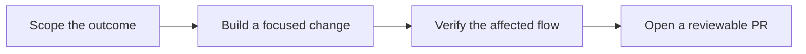

# Contributing to FLOX

> Follow the flow: **scope → build → verify → propose**.

Thank you for helping FLOX turn process knowledge into clearer, more portable
diagrams. Contributions are welcome when they stay focused, preserve the
local-first model, and include evidence appropriate to their risk.

[Project overview](README.md) · [Documentation](docs/README.md) ·
[Security policy](SECURITY.md)

## Contribution flow



### 1. Scope the outcome

- Search existing issues and pull requests before starting.
- Describe the user-visible outcome, not only the implementation technique.
- Keep unrelated cleanup out of feature and bug-fix changes.
- Discuss broad behavior, architecture, or interaction changes before investing
  in a large implementation.

### 2. Prepare the workspace

Requirements:

- Node.js 20.19 or newer, or Node.js 22.12+
- npm
- Docker only for container work or the Docker acceptance gate

```bash
git clone https://github.com/sheronrandev/FLOX.git
cd FLOX
npm ci
npm ci --prefix web
npm run dev
```

The application opens at `http://localhost:4173`. See the
[documentation hub](docs/README.md) for deployment and environment-specific
guides.

### 3. Build with FLOX's contracts in mind

- Preserve the browser-local project model unless the change explicitly
  redesigns that boundary.
- Keep canvas rendering and SVG/PNG export notation, routing, geometry, fonts,
  and label placement aligned.
- Reuse domain and Zustand commands instead of bypassing existing state
  transitions.
- Keep keyboard, focus, screen-reader, responsive, zoom, contrast, and reduced-
  motion behavior part of the implementation—not an afterthought.
- Never commit `.env` files, credentials, generated builds, test reports,
  coverage, or personal diagram exports.

### 4. Verify the change

Run the baseline gate:

```bash
npm run verify
```

Add the smallest relevant extra gate:

| Change surface | Additional evidence |
| --- | --- |
| Canvas, routing, or export | Focused canvas and SVG/PNG parity tests |
| Keyboard or visual interaction | Relevant Playwright and accessibility coverage |
| Responsive layout | Desktop and narrow-viewport screenshots or snapshots |
| API, persistence, or security | Focused server regression tests |
| Deployment | The matching Pages or Docker acceptance path |
| Documentation only | Link, command, and implementation-fact review |

The complete browser and environment matrix is in
[docs/verification.md](docs/verification.md).

### 5. Open a pull request

A strong pull request explains:

- **Outcome:** what changes for the user or maintainer.
- **Reason:** why the change belongs in FLOX.
- **Approach:** the important design or implementation decisions.
- **Verification:** the exact checks run and their results.
- **Visual evidence:** screenshots for intentional interface changes.
- **Follow-ups:** known limitations that are intentionally outside the change.

## Commit and review hygiene

- Write concise, imperative commit subjects.
- Keep generated snapshot changes intentional and reviewable.
- Update documentation when behavior, commands, configuration, or deployment
  expectations change.
- Respond to review with evidence and focused revisions.
- Do not use a public issue or pull request to disclose a vulnerability.

## Security reports

Follow [SECURITY.md](SECURITY.md) for private reporting. Public disclosure before
a fix is coordinated can put FLOX users and deployments at risk.

## License

By contributing, you agree that your contribution will be licensed under the
project's [Apache License 2.0](LICENSE).
