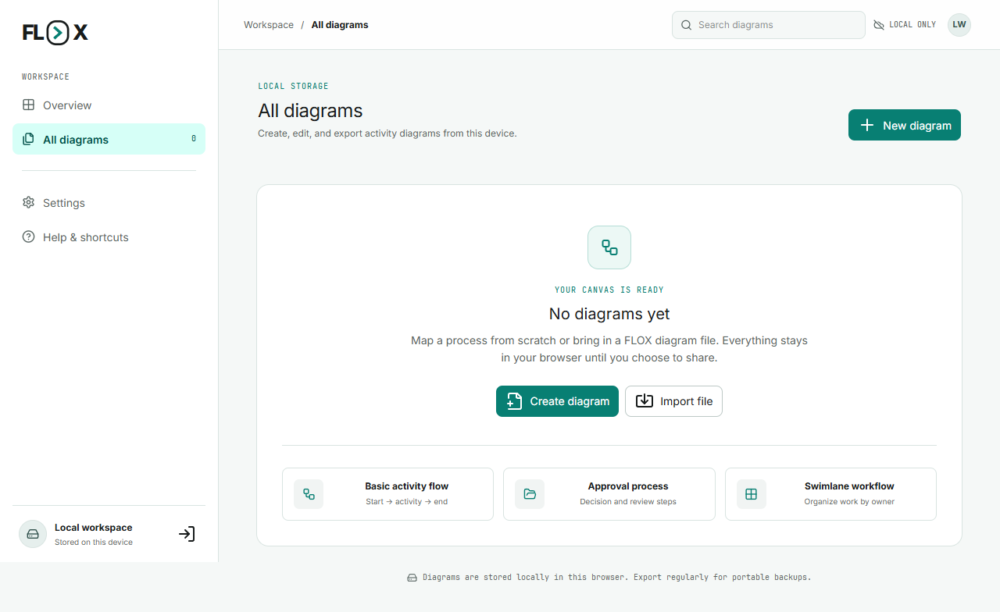
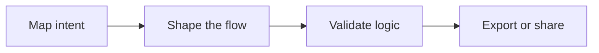
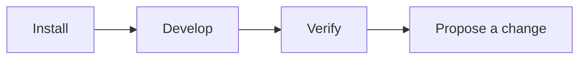
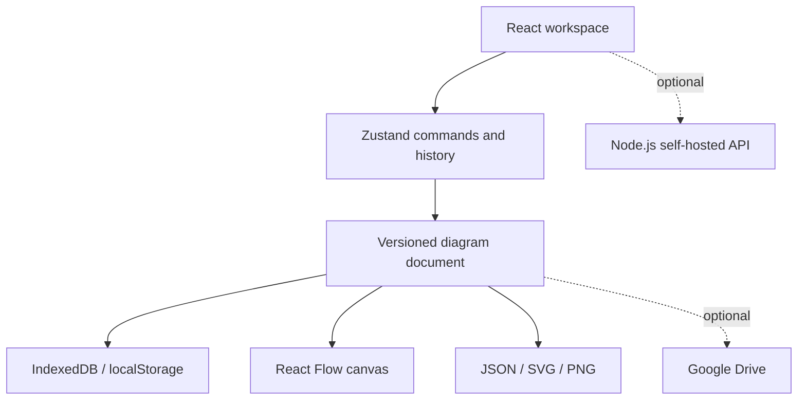

<p align="center">
  
</p>

<h1 align="center">FLOX</h1>

<p align="center"><strong>Map the work. Move with clarity.</strong></p>

<p align="center">
  A local-first UML activity diagram workspace for turning process knowledge into<br>
  clear, portable, and reviewable flows.
</p>

<p align="center">
  <a href="https://sheronrandev.github.io/FLOX/"><strong>Open FLOX</strong></a>
  ·
  <a href="#quick-start">Quick start</a>
  ·
  <a href="docs/README.md">Documentation</a>
  ·
  <a href="CONTRIBUTING.md">Contribute</a>
</p>

<p align="center">
  <a href="https://github.com/sheronrandev/FLOX/actions/workflows/ci.yml"></a>
  <a href="https://github.com/sheronrandev/FLOX/actions/workflows/deploy-pages.yml"></a>
  <a href="LICENSE"></a>
  
</p>



## From process idea to portable artifact



FLOX keeps the full workflow in one focused browser workspace. Create a diagram,
organize responsibilities with swimlanes, validate the model, and export a
versioned artifact without creating an account or surrendering ownership of the
source data.

## Why FLOX

| Principle | What it means in practice |
| --- | --- |
| **Local by default** | Projects stay in IndexedDB on the current device, with a localStorage fallback. |
| **UML-aware** | Activity, decision, initial, final, fork, and join nodes preserve recognizable activity-diagram semantics. |
| **Portable by design** | Versioned JSON supports continued editing; SVG and PNG support presentation and review. |
| **Clarity at scale** | Swimlanes, multiple processes, routed connectors, guard labels, and workspace export keep larger flows legible. |
| **Accessible interaction** | Keyboard, focus, responsive, screen-reader, zoom, contrast, and reduced-motion behavior are part of the release gates. |
| **Sharing is optional** | Google Drive is available only when configured and requested, using the narrow `drive.file` scope. |

## Capabilities

| Design | Organize | Review and deliver |
| --- | --- | --- |
| UML activity and control nodes | Structural swimlanes | Diagram validation |
| Control-flow and object-flow connectors | Multi-process workspaces | Versioned JSON import/export |
| Routed edges and guard labels | Role-aware lane management | SVG and PNG at multiple scales |
| Undo/redo and command history | Multi-select, copy, paste, and duplicate | Transparent-background export |
| Keyboard movement, zoom, and pan | Light, dark, and custom themes | Optional Google Drive upload and sharing |

## Quick start

### Use the hosted workspace

Open **[FLOX on GitHub Pages](https://sheronrandev.github.io/FLOX/)**. The
core editor, validation, local persistence, and file exports run entirely in
the browser.

> Browser storage is convenient, not a backup service. Export important
> diagrams as FLOX JSON so they remain portable.

### Run FLOX locally

Requirements:

- Node.js 20.19 or newer, or Node.js 22.12+
- npm
- Docker only for container deployment or the Docker acceptance gate

```bash
git clone https://github.com/sheronrandev/FLOX.git
cd FLOX
npm ci
npm ci --prefix web
npm run dev
```

Open `http://localhost:4173`. Vite proxies `/api` to the optional Node.js API
on port 4174. The current browser-local project flow does not require the API.

## Development workflow



| Command | Purpose |
| --- | --- |
| `npm run dev` | Start Vite and the local API |
| `npm run dev:web` | Start only Vite |
| `npm run dev:server` | Start only the Node API |
| `npm run typecheck` | Check the TypeScript project |
| `npm test` | Run the web and server test suites |
| `npm run build` | Create the production web build in `web/dist` |
| `npm run preview` | Preview the production build locally |
| `npm run test:e2e` | Run Edge, WebKit, and mobile browser tests |
| `npm run test:e2e:firefox` | Run the separate Firefox browser gate |
| `npm run verify` | Run type checking, tests, and the production build |
| `npm run verify:release` | Run the browser- and Docker-aware release gate |

Before proposing a change, read the **[contribution flow](CONTRIBUTING.md)** and
the **[verification matrix](docs/verification.md)**.

### Optional Google Drive setup

Copy `web/.env.example` to `web/.env.local`, create a Google Web OAuth client,
and set:

```bash
VITE_GOOGLE_CLIENT_ID=your-client-id.apps.googleusercontent.com
```

Register each exact development and deployment origin in Google Cloud. Never
place an OAuth client secret in frontend code. The complete setup is documented
in **[Self-hosting FLOX](docs/self-hosting.md#google-drive-sharing)**.

## Architecture at a glance



```text
web/
  src/
    auth/             optional Google authorization
    components/       application and reusable UI
    diagram/          canvas, routing, and SVG/PNG export
    domain/           schema, notation, migration, layout, validation
    pages/            routed application screens
    persistence/      IndexedDB/localStorage repositories
    store/            Zustand commands and document state
  e2e/                browser, accessibility, and visual coverage

server/
  src/                optional HTTP API, auth, storage, and security controls
  test/               API and persistence regression coverage

assets/brand/         shared brand tokens
deploy/               container reverse-proxy configuration
docs/                 operations, verification, security, and design records
```

The diagram document is the domain boundary. The canvas and SVG/PNG exporters
share notation, routing, geometry validation, and label-placement behavior so
the edited model and delivered artifact remain aligned.

## Deployment paths

| Path | Best for | Guide |
| --- | --- | --- |
| **GitHub Pages** | The static, local-first editor | [Deploying to GitHub Pages](docs/github-pages.md) |
| **Docker Compose** | A controlled self-hosted environment with the optional API | [Self-hosting FLOX](docs/self-hosting.md) |

For GitHub Pages, select **GitHub Actions** under **Settings → Pages**, then
push to `main` or manually run **Deploy GitHub Pages**. The workflow discovers
the correct base path and adds a fallback for direct navigation to application
routes.

For the container path:

```bash
docker compose up --build -d
```

Open `http://localhost:8080`. Internet-facing deployments should terminate
HTTPS in front of the web container and set `COOKIE_SECURE=true`.

## Data, privacy, and security

- Projects remain on the current device unless the user explicitly exports or
  shares them.
- Connecting Google does not move the local workspace to a FLOX server.
- Drive authorization uses `drive.file`, and access tokens stay in memory.
- Every project remains exportable as portable JSON, SVG, or PNG.
- Public container deployments require their own security review, HTTPS, secure
  cookies, protected backups, and environment-specific credentials.

Please report suspected vulnerabilities privately according to the
**[security policy](SECURITY.md)**.

## Quality model

Focused coverage protects schema migration, validation, persistence, command
history, process and swimlane management, routing, canvas/export parity,
guard-label safety, accessibility, responsive behavior, visual regression, API
path safety, CSRF, ownership, rate limiting, and revision conflicts.

GitHub Actions runs `npm run verify` for pushes and pull requests targeting
`main`. Visual snapshots are treated as reviewed product artifacts—not files to
update casually.

## Documentation

The **[documentation hub](docs/README.md)** routes each audience to the right
guide:

- [Frontend workflow and design principles](docs/frontend-workflow.md)
- [Release verification](docs/verification.md)
- [GitHub Pages deployment](docs/github-pages.md)
- [Self-hosting and Google Drive configuration](docs/self-hosting.md)
- [Security review notes](docs/security-review.md)
- [Scaling decisions](docs/scaling.md)

## Contributing

Issues and pull requests are welcome. Keep changes focused, preserve the
local-first model, and protect canvas/export parity. Start with
**[CONTRIBUTING.md](CONTRIBUTING.md)**.

## License

FLOX is available under the **[Apache License 2.0](LICENSE)**. Commercial and
private use, modification, and redistribution are permitted while copyright,
license, and attribution notices are retained.
