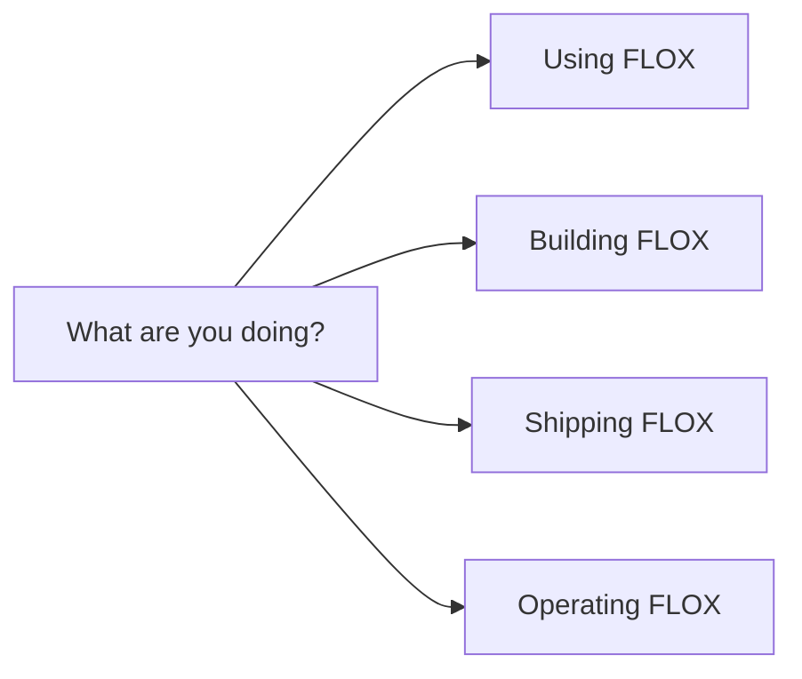

# FLOX documentation

> Choose the path that matches the work in front of you.

[Project overview](../README.md) · [Contributing](../CONTRIBUTING.md) ·
[Security](../SECURITY.md) · [Open FLOX](https://sheronrandev.github.io/FLOX/)

## Find your route

| Route | Start here | Continue with |
| --- | --- | --- |
| **Use the workspace** | [Project overview](../README.md#quick-start) | [Data, privacy, and security](../README.md#data-privacy-and-security) |
| **Contribute code or docs** | [Contribution flow](../CONTRIBUTING.md) | [Frontend workflow](frontend-workflow.md) |
| **Verify a release** | [Release verification](verification.md) | [GitHub Pages deployment](github-pages.md) |
| **Self-host FLOX** | [Self-hosting guide](self-hosting.md) | [Security review](security-review.md) |
| **Plan future scale** | [Scaling decisions](scaling.md) | [Architecture at a glance](../README.md#architecture-at-a-glance) |

## Product and engineering

### [Frontend workflow](frontend-workflow.md)

The product definition, architecture boundaries, visual direction, design
system, accessibility packet, responsive policy, and release gates for the
React workspace.

### [Release verification](verification.md)

The automated and manual quality matrix, including browser coverage, visual
snapshots, accessibility checks, Firefox constraints, and Docker acceptance.

## Deployment and operations

### [GitHub Pages deployment](github-pages.md)

The static local-first deployment path, repository configuration, optional
Google Drive environment variable, custom domains, and direct-route fallback.

### [Self-hosting FLOX](self-hosting.md)

Local development, Google OAuth configuration, Docker Compose, runtime settings,
storage layout, backup and restore, collaboration, and deployment hardening.

## Security and architecture

### [Security review notes](security-review.md)

The implemented validation and server security controls plus the current
dependency-risk assessment.

### [Scaling decisions](scaling.md)

The measured thresholds and architectural seams that should guide any move
toward realtime collaboration, multiple API replicas, or a database adapter.

## Design and delivery records

The `docs/specs/` and `docs/superpowers/` trees contain historical design,
planning, task, and review records. They explain how larger features were shaped
but do not replace the current product, contribution, verification, or
deployment guides above.

---

**FLOX documentation principle:** lead with the user path, state the boundary,
show the command, and link to the evidence.
